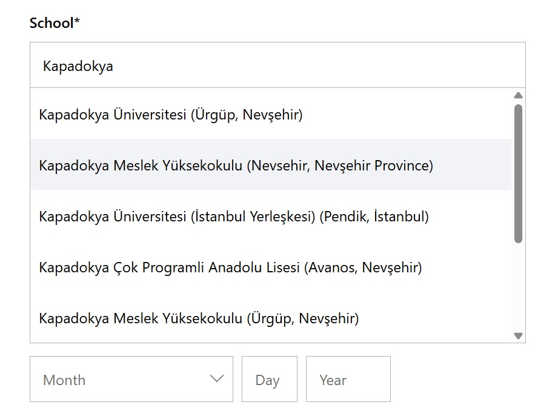

# Cursor Pro Öğrenci Doğrulama Scripti - Türkiye

Bu script, Cursor Pro'da öğrenci doğrulaması yaparken Türkiye'yi ülke seçenekleri arasına ekler.

## Kurulum

1. Tampermonkey eklentisini tarayıcınıza yükleyin:
   - [Chrome için Tampermonkey](https://chrome.google.com/webstore/detail/tampermonkey/dhdgffkkebhmkfjojejmpbldmpobfkfo)
   - [Firefox için Tampermonkey](https://addons.mozilla.org/en-US/firefox/addon/tampermonkey/)

2. Aşağıdaki bağlantıya tıklayarak veya script dosyasını Tampermonkey'e manuel olarak ekleyerek scripti yükleyin.

3. Scripti etkinleştirin ve Cursor Pro öğrenci doğrulama sayfasını ziyaret edin.

## Kullanım Adımları:

1. Microsoft Eğitim E-posta Kaydı: https://go.microsoft.com/fwlink/?linkid=2283200
2. Cursor web sitesine giriş yapın ve `VERIFY STATUS` butonuna tıklayın: https://www.cursor.com/students
3. Bu scripti Tampermonkey eklentisine yükleyin
4. Sayfayı SHIFT tuşuna basılı tutarak yenileyin - artık Türkiye seçeneği görünür olacaktır
5. Kişisel bilgilerinizi doldurun
6. SheerID doğrulaması sırasında Microsoft eğitim e-postanızı kullanın
7. E-posta gelen kutunuzu kontrol edin
8. Kayıt tamamlandı!

## Önemli Notlar:

- Script, SheerID doğrulama servisine Türkiye (TR) ülke kodunu ekler
- Türkiye'deki üniversitelerin seçilebilmesini sağlar
- Tampermonkey veya benzeri bir userscript yöneticisi gereklidir

## Nasıl Çalışır?

Script, SheerID'nin API yanıtlarını izler ve ülke listesine Türkiye'yi (TR) ekler. Bu sayede:

- Ülke seçiminde Türkiye görünür olur
- Türk üniversiteleri listeye eklenir
- Doğrulama süreci sorunsuz ilerler

## Güvenlik

- Script açık kaynak kodludur
- Sadece ülke listesine Türkiye'yi ekler
- Kişisel verilerinize müdahale etmez